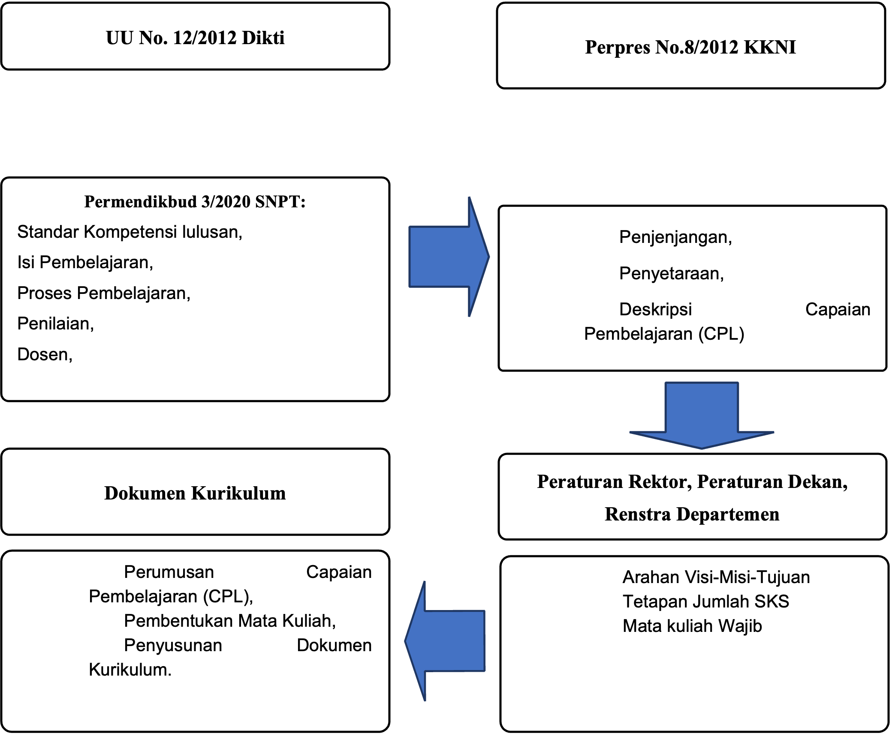

## Latar Belakang

Perubahan kurikulum ini adalah tanggapan atas berbagai perubahan yang terjadi secara multidimensi baik pada sisi aturan, visi saintifik, serta berkembangnya kebutuhan pemangku kepentingan. Kerangka formal perubahan serta manifestasi realisasi kurikulum akan sangat kental berpegangan pada aspek aturan formal baik di tingkat nasional maupun di tingkat universitas. Sementara perubahan kondisi keilmuan hingga perubahan kebutuhan pemangku kepentingan akan menjadi landasan abstraktif yang memberikan panduan pada unsur realisasi struktural kurikulum. Peta aturan yang menjadi rujukan perubahan kurikulum disajikan pada @fig-peta_rujukan Pendidikan magister adalah bagian dari proses pendidikan tinggi yang berlandaskan pada Undang-undang Republik Indonesia Nomor 12 Tahun 2012 tentang Pendidikan Tinggi.

{#fig-peta_rujukan fig-align="center" width="70%"}

Pendidikan magister adalah bagian dari proses pendidikan tinggi yang berlandaskan pada Undang-Undang Republik Indonesia Nomor 12 Tahun 2012 tentang Pendidikan Tinggi. Posisi lulusan yang merupakan luaran pendidikan pascasarjana tingkat magister ini dipetakan posisinya dalam skup nasional dalam Peraturan Presiden Republik Indonesia Nomor 8 Tahun 2012 tentang Kerangka Kualifikasi Nasional Indonesia. Peraturan ini memandu dengan jelas arah pendidikan magister dengan menempatkannya pada level 8 dan memberikan deskripsi atas jenjang kualifikasinya.

Realisasi dari Kerangka Kualifikasi Nasional Indonesia (KKNI) pada tataran proses pendidikan memerlukan perumusan berbagai standar minimal yang harus terpenuhi sebagaimana diamanatkan oleh UU No. 12 tahun 2012 tentang Perguruan Tinggi pada Pasal 52 ayat 3. Standar ini, pada kurikulum sebelumnya tertuang dalam Standar Nasional Pendidikan Tinggi (SNPT) (Peraturan Menteri Pendidikan, Kebudayaan, Riset, dan Teknologi Republik Indonesia Nomor 53 Tahun 2023) yang digantikan oleh Penjaminan Mutu Pendidikan Tinggi (PMPT) (Peraturan Menteri Pendidikan Tinggi, Sains, dan Teknologi Nomor 39 Tahun 2025). Relasi berbagai aturan tersebut dapat dirangkum menjadi diagram seperti ditunjukkan pada Gambar 1.1.

Berbagai aturan di tingkat nasional diejawantahkan dalam kerangka aturan di tingkat UGM dalam berbagai aturan rektor terkait pendidikan pascasarjana. Kurikulum program magister pada dasarnya terkait erat dengan Peraturan Rektor UGM No. 11 Tahun 2016 tentang Pendidikan Pascasarjana. Kurikulum perlu disesuaikan karena terbitnya Peraturan Rektor UGM No. 18 Tahun 2019 tentang Penyelenggaraan Program Pascasarjana Berbasis Penelitian (*by Research*) di Lingkungan Universitas Gadjah Mada. Selanjutnya kerangka kurikulum disesuaikan dengan terbitnya Peraturan Rektor No. 23 Tahun 2024 yang menggantikan Peraturan Rektor No. 14 Tahun 2020.

Selain aturan, perubahan kurikulum juga dipicu oleh kesadaran bahwa bidang teknik elektro adalah bidang yang memberi warna pada perkembangan peradaban abad ini. Dengan sifatnya yang unik, ilmu ini bersimbiosis mendorong bidang ilmu lain untuk berakselerasi. Kemampuan unik ini lahir dari fakta bahwa teknik elektro mengakomodasi tiga dimensi dalam sebuah wadah yang kompak: dimensi energi-dimensi isyarat-dimensi informasi. Perwujudan ketiga dimensi tersebut dapat muncul secara mandiri-eksklusif pada wadah ilmu teknik elektro atau bersama ilmu lain mendukung kemajuan peradaban.

Capaian dekade ini, dari penyatuan ilmu teknik elektro dengan berbagai bidang ilmu lain, telah melahirkan visi-visi baru yang cenderung melahirkan tatanan baru menggantikan tatanan lama (era disrupsi). Dunia barat, diwakili Jerman, cenderung mewadahinya dalam skema industri generasi 4 (I4.0). Sementara dunia timur, yang diwakili Jepang, Korea, dan Tiongkok, menawarkan sudut pandang masyarakat generasi 5.0 (S5.0). Kedua tatanan ini adalah gabungan dari kesatuan energi-isyarat-informasi yang berinteraksi erat dengan berbagai bidang ilmu lain dalam kerangka tatanan sosial baru. Pandemi COVID-19 turut membawa unsur pemaksa perubahan zaman. Tumbuhnya generasi muda gen z dengan karakteristik *digital native* dan gaya belajar interaktif, mendorong perubahan kurikulum menuju pembelajaran yang lebih fleksibel, inovatif, dan terintegrasi dengan teknologi terkini. Perubahan zaman ini perlu disikapi dengan bijak pada struktur kurikulum baru ini.

Saat ini terjadi perubahan pada standar nasional pendidikan tinggi yang saat ini untuk bidang teknik elektro dilaksanakan oleh Lembaga Akreditasi Mandiri (LAM) Teknik. Hal ini juga akan mengubah struktur maupun standar kurikulum di bidang teknik elektro. Selain itu, PMPSTI di DTETI juga memperbarui kurikulumnya sehingga sinkronisasi dengan PMPSTI sangat perlu dilakukan.

Di samping itu, Peraturan Menteri Pendidikan Tinggi, Sains, dan Teknologi Nomor 39 Tahun 2025 (Permendiktisaintek Nomor 39 Tahun 2025) tentang Penjaminan Mutu Pendidikan Tinggi dan Peraturan Rektor UGM No. 23 Tahun 2024 yang mensyaratkan beban studi program magister minimal 36 SKS juga menjadi landasan penyesuaian kurikulum pada Kurikulum 2022 Versi Revisi-2. Distribusi bidang kerja lulusan PMPSTE yang mayoritas berada di bidang pendidikan memerlukan penguatan kemampuan penelitian.