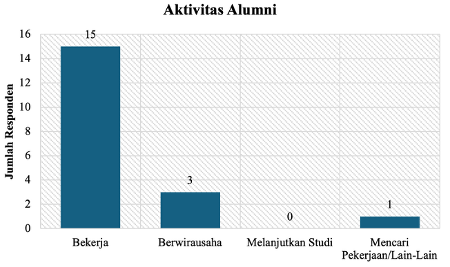
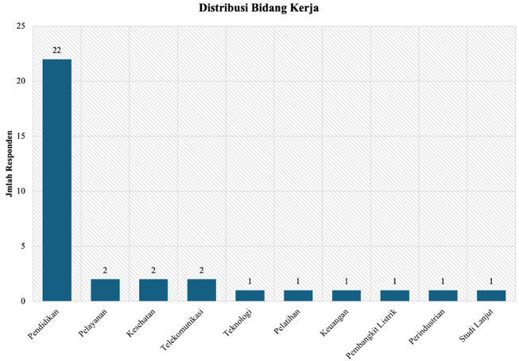
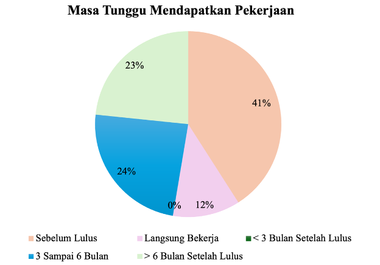
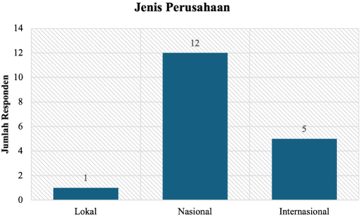
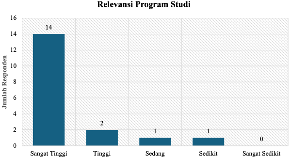
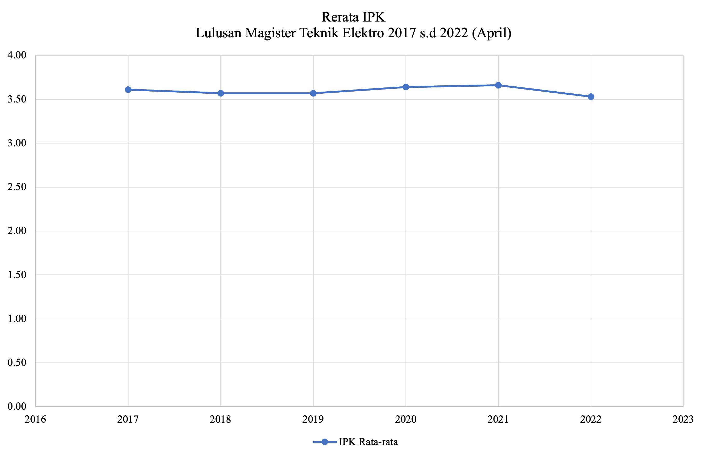
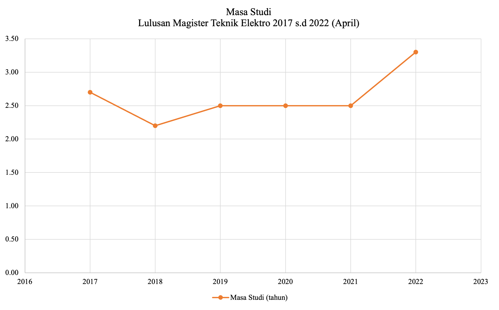
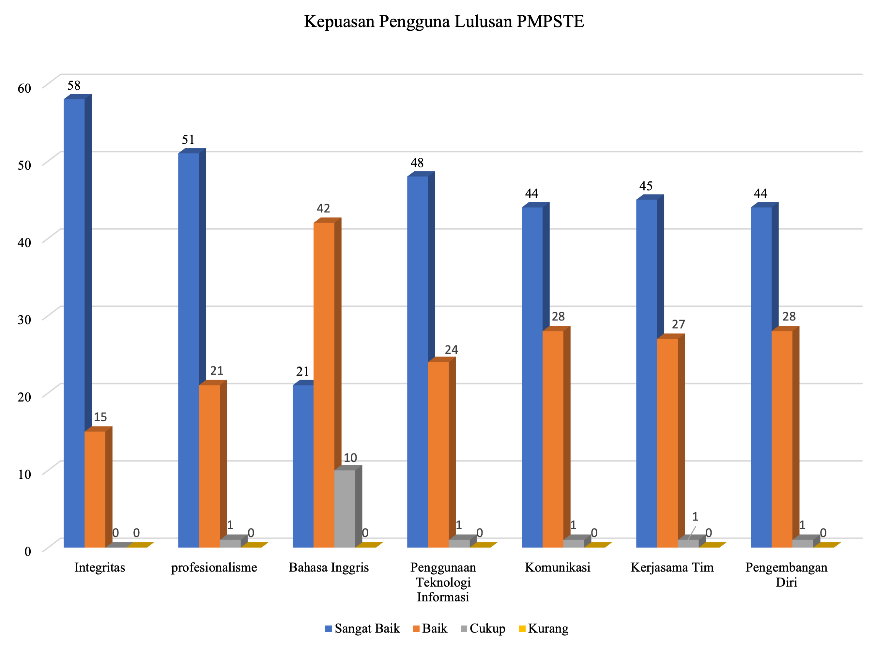

## Tracer Study dan Stakeholder Input

Kurikulum 2022 Versi Revisi-2 merupakan penyesuaian Kurikulum 2022 dengan Peraturan Menteri Pendidikan Tinggi, Sains, dan Teknologi Nomor 39 Tahun 2025 tentang Penjaminan Mutu Pendidikan Tinggi dan Peraturan Dekan No. 1 Tahun 2025 tentang Pendidikan Pasca Sarjana. Pada kurikulum ini, tidak ada perubahan mendasar pada landasan filosofis, psikologis, historis, yuridis, dan sosiologis, sehingga tracer study tetap menggunakan tracer study sebelumnya. Dalam tahap pemutakhiran kurikulum, hasil tracer study dengan responden alumni dan pengguna alumni merupakan rujukan yang penting. Hasil tracer study dapat memberikan evaluasi atas ketercapaian outcome pendidikan setelah 1–5 tahun pasca kelulusan. Departemen melalui tim tracer study melakukan survei terhadap alumni PMPSTE angkatan 2011–2017 yang melalui proses pendidikan di PMPSTE. Beberapa hasil tracer study yang dilaksanakan di tahun 2023 menggunakan data dari 34 responden tergambar sebagai berikut.

@fig-bidang_pekerjaan_lulusan menunjukkan bahwa lulusan PMPSTE hampir semuanya bekerja. @fig-distribusi_bidang_kerja (survey tahun 2022) menunjukkan bahwa distribusi karier lulusan PMPSTE cukup beragam dengan proporsi terbesar bekerja di bidang kerja pendidikan yaitu di perguruan tinggi serta pemerintahan. Fakta ini menjadi pertimbangan bagi tim kurikulum dan program studi dalam memperbarui profil lulusan PMPSTE.

{#fig-bidang_pekerjaan_lulusan fig-align="center"}

{#fig-distribusi_bidang_kerja fig-align="center"}

@fig-lama_mendapatkan_pekerjaan menunjukkan grafik lama tunggu kerja, yaitu seberapa lama lulusan dapat atau mulai memasuki dunia kerja sejak kelulusannya. Informasi terhadap masa tunggu tersebut bertujuan untuk mengetahui gambaran potensi serapan kerja alumni Program Magister Program Studi Teknik Elektro dalam dunia kerja. Hasil tracer study menunjukkan bahwa 7 responden telah memperoleh pekerjaan bahkan sebelum menyelesaikan studi, sementara 2 responden langsung bekerja setelah kelulusan. Sebanyak 5 responden memperoleh pekerjaan dalam jangka waktu 3 hingga 6 bulan setelah kelulusan, dan 4 responden lainnya dalam rentang waktu lebih dari 6 bulan. Meskipun demikian, tidak ada responden yang memperoleh pekerjaan lebih dari 12 bulan setelah kelulusan. Hal ini menunjukkan bahwa lulusan PMPSTE relatif mendapatkan pekerjaan dengan masa tunggu yang tidak terlalu lama, yaitu kurang dari 1 tahun.

{#fig-lama_mendapatkan_pekerjaan fig-align="center"}

Di sisi jenis perusahaan tempat bekerja ditunjukkan pada @fig-tingkat_ukuran_tempat. Mayoritas bekerja di tingkat nasional, dengan 12 responden, 5 responden bekerja di perusahaan internasional, dan 1 responden bekerja di tingkat lokal. Jumlah responden ini merupakan sampel dari lulusan tahun 2023 dan dianggap mewakili jenis perusahaan tempat lulusan.

{#fig-tingkat_ukuran_tempat fig-align="center"}

@fig-tingkat_kesesuaian_topik menunjukkan relevansi program studi terhadap bidang pekerjaan. Berdasarkan hasil tracer study, sebanyak 14 responden menyatakan bahwa relevansi antara program studi yang diambil dengan bidang pekerjaan mereka tergolong sangat tinggi, sementara 2 responden menilai relevansinya tinggi. Adapun tingkat relevansi sedang dan rendah masing-masing diungkapkan oleh 1 responden. Tidak terdapat responden yang menyatakan relevansi program studi dengan bidang pekerjaan mereka sangat rendah.

{#fig-tingkat_kesesuaian_topik fig-align="center"}

{#fig-hasillulusan fig-align="center"}

{#fig-lama-study fig-align="center"}

@fig-hasillulusan dan @fig-lama-study adalah survey tentang IPK lulusan dan lama masa studi (survey tahun 2022). @fig-hasillulusan menunjukkan bahwa dari data lulusan PMPSTE tahun 2017 sampai dengan 2021 rerata IPK mahasiswa adalah 3,60 dengan IPK tertinggi adalah 4,00 dan IPK terendah 3,00. Hasil tracer study memperlihatkan bahwa mayoritas alumni Program Magister Program Studi Teknik Elektro lulus dengan Indeks Prestasi Kumulatif yang sangat baik dengan rerata IPK kelulusan berada pada rentang 3,51-3,75 skala 4 yaitu sebanyak 14 responden. Sebanyak 9 responden lulus dengan rentang IPK 3,26-3,50; sebanyak 7 responden lulus dengan rentang IPK 3,76-4,00; dan sebanyak 2 responden lulus dengan rentang IPK 3,01-3,25. IPK rerata total lebih dari 3,50. @fig-lama-study menunjukkan masa studi rerata adalah 2,5 tahun. Hasil tracer study menunjukkan bahwa mayoritas responden menempuh lama studi di PMPSTE DTETI FT UGM dalam rentang waktu antara 1 sampai 1,5 tahun dan rata-rata responden menempuh masa studi antara 2 tahun sampai 3,5 tahun. Hal ini perlu menjadi pertimbangan dalam perbaikan kurikulum agar mayoritas mahasiswa PMPSTE bisa menyelesaikan studinya tepat waktu.

{#fig-survey-kepuasan-pengguna fig-align="center"}

@fig-survey-kepuasan-pengguna menunjukkan mayoritas pengguna lulusan PMPSTE yang puas adalah bidang pendidikan dan pemerintahan (survey tahun 2022). Dari gambar tersebut, terlihat bahwa lulusan PMPSTE menunjukkan standar kinerja yang sangat memuaskan. PMPSTE berkomitmen untuk menanamkan nilai-nilai profesional kepada mahasiswa sebagai bekal dalam meniti karir di bidang teknik. Nilai-nilai ini menjadi dasar dalam merumuskan program educational objectives (PEO) yang mencerminkan kualitas lulusan yang diharapkan sejak mereka menyelesaikan studi. Perumusan PEO ini melibatkan masukan dari berbagai pihak, termasuk stakeholders program yang diwakili oleh advisory board, serta mengacu pada visi dan misi berjenjang dari UGM hingga program studi. Penjaringan pendapat dan masukan dilakukan melalui mekanisme workshop, kunjungan konsultasi, dan berbagai pertemuan baik formal atau pun informal (ditunjukkan pada Lampiran H). Hasil perumusan ini menghasilkan dua profil utama lulusan. Pertama, sebagai akademisi, lulusan diharapkan menjadi peneliti atau pendidik yang kompeten, menjunjung tinggi etika ilmiah, mampu bekerja secara individu maupun dalam tim, memiliki jiwa kepemimpinan, dan berkomitmen pada pembelajaran sepanjang hayat di institusi pendidikan seperti universitas atau politeknik. Kedua, sebagai profesional, lulusan dituntut mampu memecahkan masalah di industri secara ilmiah dan terstruktur, mengomunikasikan ide secara efektif, serta bekerja sama dalam tim maupun mandiri. Mereka juga diharapkan mampu mengintegrasikan keahlian Teknik Elektro dengan manajemen demi mendukung pencapaian tujuan organisasi, termasuk di lingkungan pemerintahan.