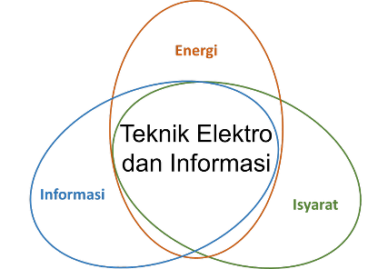
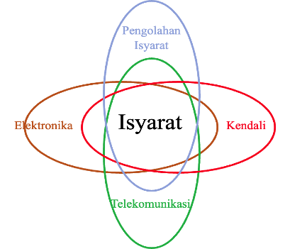

## Penetapan Bahan Kajian

Kurikulum 2022 - Revisi 2 yang saat ini dijalankan PMPSTE dibangun selaras dengan kondisi perkembangan ilmu teknik elektro pada saat kurikulum tersebut dibuat serta peraturan pemerintah terkait pendidikan yang berlaku seperti Keputusan Menteri Pendidikan Nasional Nomor 232 tahun 2000 dan Nomor 045 Tahun 2002 yang mengamanatkan penyusunan kurikulum pendidikan tinggi berbasis kompetensi. Perkembangan terkini, baik pada bidang keilmuan, aturan kependidikan nasional, ketentuan akreditasi lokal maupun internasional, serta kondisi masyarakat secara global menuntut evaluasi kurikulum yang ada saat ini. Untuk itu, melalui serangkaian proses evaluasi dan mempertimbangkan masukan dari *advisory board* DTETI, kurikulum PMPSTE dipandang perlu untuk dilakukan langkah-langkah pembaharuan dan penyesuaian.

Pendidikan program magister teknik elektro pada PMPSTE didesain untuk mempersiapkan lulusan dengan kemampuan sebagai berikut.

1.  Kemampuan untuk mengidentifikasi masalah teknik yang kompleks dan kemampuan menyelesaikannya berbasis ilmu teknik elektro dengan memanfaatkan teknologi terkini.

2.  Kemampuan untuk membangun model untuk merancang dan melakukan eksperimen untuk mengeksplorasi masalah rekayasa yang kompleks serta menganalisis dan menginterpretasikan data.

3.  Kemampuan untuk membuat karya ilmiah/laporan/dokumentasi, kemampuan untuk berkomunikasi secara lisan dengan efektif serta memberikan dan mengikuti instruksi secara jelas.

4.  Profesional dan tanggung jawab teknik elektro yang lebih besar, dan/atau dengan transisi ke posisi kepemimpinan dalam bisnis, pemerintahan, mengelola tim. Kemampuan untuk memiliki peran secara efektif dalam memimpin dan mengelola kerja di dalam tim untuk mencapai tujuan bersama.

5.  Kemampuan untuk memahami nilai-nilai etika dan berkomitmen pada norma, tanggung jawab dan etika profesi.

6.  Kemampuan untuk mewujudkan pentingnya pembelajaran seumur hidup dan mampu melaksanakannya.

Keenam hal tersebut di atas selaras dengan deskripsi jenjang kualifikasi yang disebutkan pada Lampiran Peraturan Presiden Republik Indonesia Nomor 8 Tahun 2012 di mana program magister menempati level delapan dalam KKNI.

Kemampuan riset mahasiswa diasah dalam dua konsentrasi:

1.  Sistem Tenaga Listrik (STL), dan

2.  Sistem Isyarat dan Elektronis (SIE).

Pengelompokan ini dilakukan dengan pertimbangan sebagai berikut:

1.  Kemudahan dalam mengkonsolidasikan dan mengintegrasikan sumber daya yang ada, baik berupa kompetensi pendidik, ketersediaan penunjang pendidikan dan penelitian, serta hubungan dengan jejaring di luar.

2.  Keluwesan dalam mengikuti perkembangan *state of the art* keilmuan di masing-masing bidang.

Kurikulum ini disusun dengan berlandaskan pada KKNI yang di dalamnya terkandung semangat *outcome-based education*. Atribut lulusan yang dicapai saat lulus telah sebangun dengan kompetensi profesional pada jenjang kualifikasi kedelapan pada KKNI.

Dari sisi ilmu, bidang teknik elektro dalam era modern telah berkembang pesat dan memberikan warna pada seluruh bidang ilmu lain. Hal ini mengakibatkan makin kaburnya batas-batas disiplin ilmu. Berkembangnya ilmu komputasi dan ilmu digital telah mengakibatkan pula munculnya tren baru yakni peranti virtual. Terkait hal tersebut, lulusan program PMPSTE dituntut tidak saja memiliki wawasan yang luas sehingga mampu memberikan sumbangsih dalam bidang ilmunya dan bidang ilmu yang lain. Selain itu, sarjana teknik elektro juga dituntut untuk memiliki kemampuan baru yakni mampu berinteraksi dengan peranti virtual dengan perantaraan rutin kode dan program untuk berinteraksi dengan peranti virtual tanpa harus kehilangan pemahaman atas konsep-konsep dasar bidang elektro.

Dari sudut pandang tantangan global, standarisasi kompetensi lulusan adalah aspek yang disoroti terutama terkait KKNI. Hal ini penting agar lulusan dapat bersaing untuk menghadapi pasar bebas dalam kerangka Masyarakat Ekonomi ASEAN (MEA), AFTA, bahkan hingga kompetensi global.

Dalam kerangka hal-hal yang telah tersebut di atas, Kurikulum 2022 Versi Revisi-1ini disusun.  Di samping itu, dalam menetapkan Kurikulum PMPSTE 2025, tim kurikulum memperhatikan perpotongan (*intersection*)dengan program studi lain, khususnya keilmuan program studi serumpun seperti teknologi informasi, teknik komputer, dan lain-lain.  Secara umum, keilmuan di teknik elektro memiliki tiga dimensi yaitu dimensi energi, isyarat, dan informasi.  Keilmuan PMPSTE lebih banyak fokus di ranah energi dan isyarat. Dimensi informasi saat ini berkembang sangat pesat dan memiliki banyak bidang keilmuan yang tumbuh, seperti *cyber security, software engineering, artificial intelligence*, dan lain sebagainya, sehingga di DTETI tumbuh menjadi prodi tersendiri.Namun demikian, dimensi informasi ini tetap tidak bisa dipisahkan sepenuhnya dari keilmuan PMPSTE.

Ranah pertama yaitu energi menitikberatkan proses pembangkitan, transmisi, dan distribusi energi listrik dari pembangkit ke pelanggan dengan mempertimbangkan aspek ekonomis, keamanan, dan keandalan. Sedangkan ranah isyarat mencakup pengiriman informasi dari suatu tempat ke tampat lain. Dengan sudut pandang keilmuan di atas, PMPSTE memiliki dua buah konsentrasi yaitu Sistem Tenaga Listrik (STL) dan Sistem Isyarat dan Elektronis (SIE).

{#fig-pmpste}

{#fig-isyarat}

KDi bidang isyarat, dimensi keilmuan dapat dibagi lagi secara lebih detail. Ranah isyarat dibagi menjadi kelompok keilmuan yang lebih sempit yaitu pengolahan isyarat, elektronika, telekomunikasi, dan kendali. Masing-masing saling beririsan satu sama lain dengan konsentrasi yang lebih banyak ke subbidangnya masing-masing.