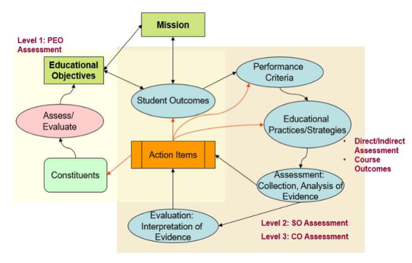

## Sistem Penilaian

Ujian dapat dilaksanakan dengan berbagai macam cara, seperti ujian tulis, ujian lisan, ujian dalam bentuk seminar, ujian dalam bentuk pembuatan laporan teknis, pekerjaan rumah, dan sebagainya. Ujian dapat pula dilaksanakan dengan berbagai kombinasi cara-cara tersebut. Cara ujian yang digunakan disesuaikan dengan sifat pendidikan. Ujian diselenggarakan dengan tujuan untuk:

1.  menilai apakah mahasiswa telah memahami bahan yang diajarkan,

2.  mengelompokkan mahasiswa berdasarkan kemampuan ke dalam kelompok amat baik (A), kelompok baik (B), kelompok cukup (C), kelompok kurang (D), dan kelompok jelek (kelompok E),

3.  menilai apakah bahan yang diajarkan telah sesuai serta cara menyampaikannya telah cukup baik sehingga para mahasiswa dengan usaha yang wajar dapat memahami bahan tersebut.

Agar maksud dan tujuan penyelenggaraan ujian dapat tercapai, perlu diadakan lebih dari satu kali ujian yaitu satu kali ujian akhir semester dan sekurang-kurangnya satu kali ujian sisipan. Dalam menentukan nilai akhir, bobot nilai-nilai sebagai komponen penyusun nilai akhir perlu ditentukan dan diberitahukan kepada mahasiswa. Ujian sisipan dan akhir hanya dapat dilaksanakan pada waktu yang telah dijadwalkan oleh Departemen Teknik Elektro dan Teknologi Informasi. Rentang penilaian yang digunakan mengikuti apa yang telah ditetapkan dalam Keputusan Rektor UGM No. 1666/UN1.P.I/SK/HUKOR/2016 ditunjukkan pada @tbl-standar-penilaian.

| Nilai Huruf | Nilai Angka |
|:-----------:|:-----------:|
|      A      |    4,00     |
|     A-      |    3,75     |
|     A/B     |    3,50     |
|     B+      |    3,25     |
|      B      |    3,00     |
|     B-      |    2,75     |
|     B/C     |    2,50     |
|     C+      |    2,25     |
|      C      |    2,00     |
|     C-      |    1,75     |
|     C/D     |    1,50     |
|     D+      |    1,25     |
|      D      |    1,00     |
|      E      |      0      |

: Standar Penilaian {#tbl-standar-penilaian .w-auto .mx-auto}

Agar maksud dan tujuan penyelenggaraan ujian dapat tercapai, perlu diadakan lebih dari satu kali ujian yaitu satu kali ujian akhir semester dan sekurang-kurangnya satu kali ujian sisipan. Dalam menentukan nilai akhir, bobot nilai-nilai sebagai komponen penyusun nilai akhir perlu ditentukan dan diberitahukan kepada mahasiswa. Ujian sisipan dan akhir hanya dapat dilaksanakan pada waktu yang telah dijadwalkan oleh DTETI.

Di samping itu, untuk menjamin agar lulusan memiliki  PEO dan *Student Outcome* (SO) seperti yang sudah di tetapkan oleh tim kurikulum PMPSTE, maka proses penjaminan mutu perlu dilakukan terus menerus. Secara umum, proses *Plan-Do-Check-Action* (PDCA) di DTETI ditunjukkan oleh \@fig-pdca. Terlihat bahwa proses PDCA memiliki tiga level yaitu:

1.  [*Level 1: PEO assessment*]{.underline}, proses evaluasi ini adalah *loop* yang paling panjang yang dilakukan 3-5 tahun sekali. Proses ini melibatkan *constituents* seperti alumni, pengguna, ataupun *advisory boards*,

2.  [*Level 2: SO assessment*]{.underline}, proses ini adalah *loop* menengah yang dapat dilakukan satu tahun sekali. Pada proses ini, ketercapaian setiap SO dihitung dengan menggunakan *direct assessment* seperti hasil ujian ataupun *indirect assessment* menggunakan survei. Pada proses perhitungan ketercapaian SO ini, akan dihasilkan *action items* yang digunakan untuk perbaikan ketercapaian SO pada periode berikutnya,

3.  [*Level 3: Learning Outcome (LO) assessment*]{.underline}, proses ini adalah proses paling bawah dan *loop* paling cepat yang dilakukan pada level mata kuliah. *Assessment* ini dilakukan oleh dosen pengampu mata kuliah tertentu yang melakukan evaluasi ketercapaian berdasarkan  LO yang dibebankan pada mata kuliah tersebut.

{#fig-pdca}